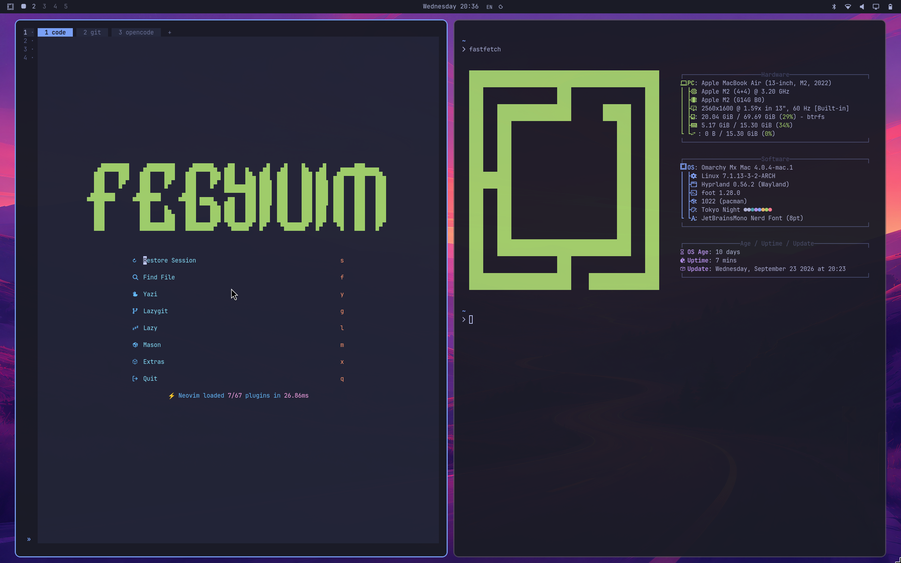

```ascii
████████▄   ▄██████▄      ███        ▄████████  ▄█   ▄█          ▄████████    ▄████████
███   ▀███ ███    ███ ▀█████████▄   ███    ███ ███  ███         ███    ███   ███    ███
███    ███ ███    ███    ▀███▀▀██   ███    █▀  ███▌ ███         ███    █▀    ███    █▀
███    ███ ███    ███     ███   ▀  ▄███▄▄▄     ███▌ ███        ▄███▄▄▄       ███
███    ███ ███    ███     ███     ▀▀███▀▀▀     ███▌ ███       ▀▀███▀▀▀     ▀███████████
███    ███ ███    ███     ███       ███        ███  ███         ███    █▄           ███
███   ▄███ ███    ███     ███       ███        ███  ███▌    ▄   ███    ███    ▄█    ███
████████▀   ▀██████▀     ▄████▀     ███        █▀   █████▄▄██   ██████████  ▄████████▀
```

Personal configuration for my daily setup across macOS and Linux (Hyprland/Omarchy). Managed with [GNU Stow](https://www.gnu.org/software/stow/).

## What's inside

| Category         | Tools                                                 |
| ---------------- | ----------------------------------------------------- |
| Shell & terminal | `zsh`, `starship`, `tmux`, `ghostty`, `herdr`, `tmux` |
| Editors          | `nvim` (LazyVim)                                      |
| Git tooling      | `git`, `lazygit`                                      |
| Window manager   | `hypr` (Hyprland), `waybar`                           |
| Input remapping  | `karabiner`, `keyd`                                   |
| CLI utilities    | `bat`, `btop`, `yazi`                                 |
| AI / agents      | `opencode`                                            |

## Install

Clone the repo, then use Stow to symlink whichever packages you want into `$HOME`:

```sh
git clone https://github.com/fegyi001/dotfiles ~/dotfiles
cd ~/dotfiles
stow .
```

`install/` and `voyager/` are excluded from stowing (see `.stow-local-ignore`) since they're not meant to be symlinked into `$HOME`.

### macOS package bootstrap

Homebrew formulas and casks are tracked in `install/formulas.txt` and `install/casks.txt`:

```sh
install/install-formulas.sh   # install tracked formulas
install/install-casks.sh      # install tracked casks (GUI apps)
install/backup-brew.sh        # regenerate the tracked lists from current brew state
```

## Notes

These are personal configs tuned for my own workflow — feel free to borrow anything useful, but expect some assumptions specific to my machines (paths, hardware, app choices).


